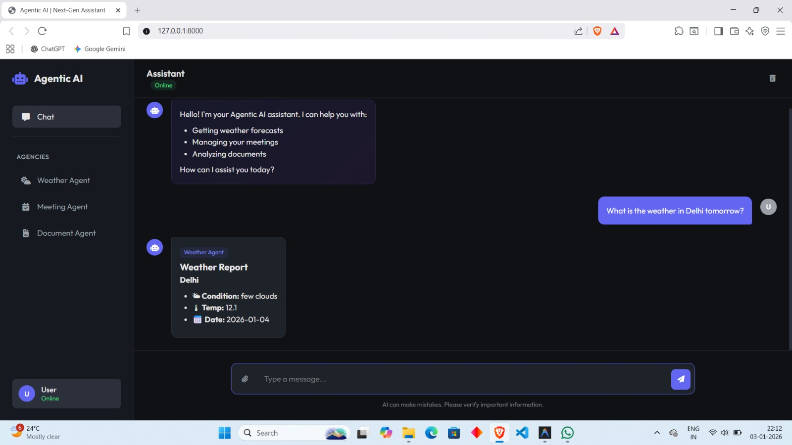
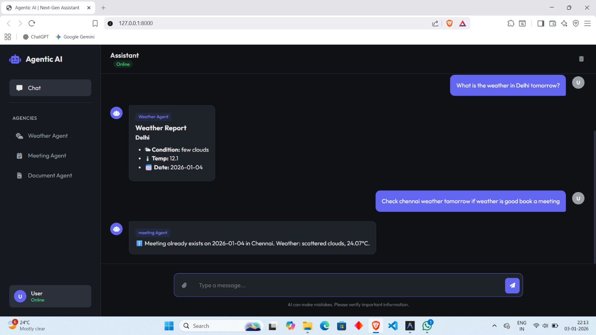
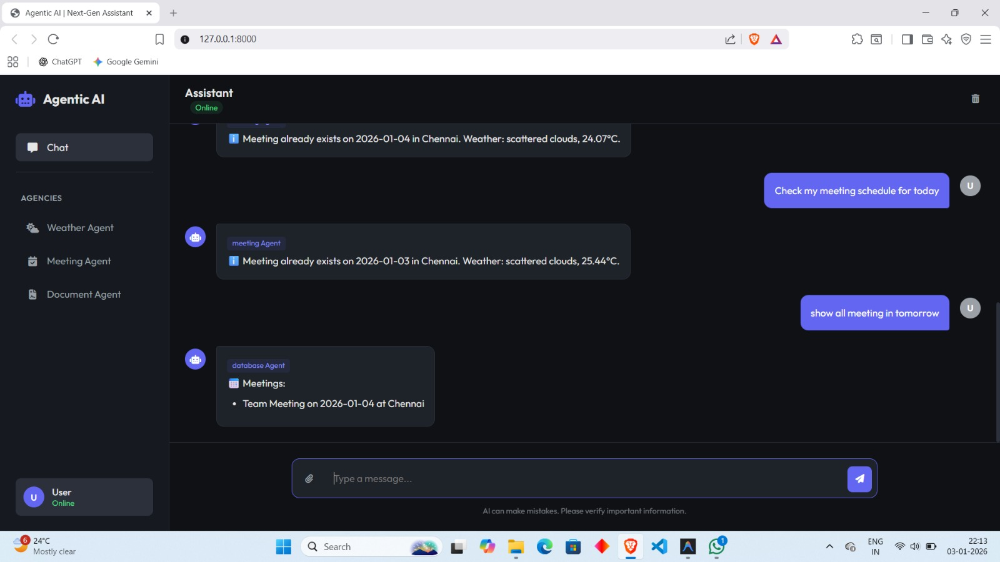

# Agentic AI Chatbot

A multi-agent AI system built with FastAPI that intelligently routes user queries to specialized agents. The system features a web-based chat interface and supports document analysis, meeting scheduling, weather checking, and database queries.

## 🚀 Features

- **Document Analysis Agent**:
    - Upload PDF or TXT files.
    - Ask questions about the content.
    - Automatic fallback to **Web Search** (DuckDuckGo) if the answer is not in the document.
- **Meeting Agent**:
    - Schedule meetings with natural language (e.g., "Book a meeting in Delhi tomorrow").
    - Intelligently checks **Weather** conditions before scheduling.
    - Prevents double-booking.
- **Weather Agent**:
    - Get real-time weather information for cities.
- **Database Agent**:
    - Query scheduled meetings (e.g., "Show me all meetings next week").

## 🛠️ Tech Stack

- **Backend**: Python, FastAPI
- **Frontend**: HTML5, CSS3, Vanilla JavaScript
- **Tools**:
    - `pypdf` for document parsing
    - `duckduckgo-search` for web browsing
    - `OpenWeatherMap API` for weather data

## 📋 Prerequisites

- Python 3.8+
- An API Key from [OpenWeatherMap](https://openweathermap.org/api)

## ⚙️ Installation

1. **Clone the repository**
   ```bash
   git clone <repository-url>
   cd agent-ai
   ```

2. **Create a virtual environment**
   ```bash
   python -m venv venv
   source venv/bin/activate  # On Windows: venv\Scripts\activate
   ```

3. **Install dependencies**
   ```bash
   pip install fastapi uvicorn python-multipart python-dotenv pypdf duckduckgo-search requests
   ```

4. **Configure Environment Variables**
   Create a `.env` file in the root directory and add your OpenWeatherMap API key:
   ```env
   OPENWEATHER_API_KEY=your_api_key_here
   ```

## 🏃‍♂️ Usage

1. **Start the server**
   ```bash
   uvicorn app.main:app --reload
   ```

2. **Access the application**
   Open your browser and navigate to:
   [http://127.0.0.1:8000](http://127.0.0.1:8000)

## 📂 Project Structure

```
agent-ai/
├── app/
│   ├── agents/          # Agent logic (Chat router, Document, Meeting, Weather, DB)
│   ├── schemas/         # Pydantic models
│   ├── static/          # Frontend assets (HTML, CSS, JS)
│   ├── tools/           # External tool implementations (PDF reader, Search, API calls)
│   ├── utils/           # Helper utilities
│   ├── config.py        # Configuration & Env Loading
│   └── main.py          # FastAPI application entry point
├── uploads/             # Directory for user-uploaded documents
└── .env                 # Environment variables
```
## 📸 Screenshots

Below are some screenshots showcasing the key features and interface of the application:

### 🖼️ Screenshot 1


### 🖼️ Screenshot 2


### 🖼️ Screenshot 3


### 🖼️ Screenshot 4



## 🤝 Contributing

Contributions are welcome! Please feel free to submit a Pull Request.

